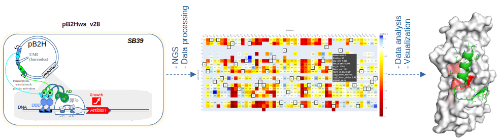

# mave2imap

==============================
### Table of contents

- [mave2imap](#mave2imap)
- 
    - [Table of contents](#table-of-contents)
    - [Description](#description)
    - [Install (Linux)](#install-linux)
    - [Testing](#testing)
      - [*1) Create a folder for testing and download testing files* :construction:](#1-create-a-folder-for-testing-and-download-testing-files-construction)
      - [*2) Run mave2imap pipeline for each targeted region.* :computer:](#2-run-mave2imap-pipeline-for-each-targeted-region-computer)
      - [*3)  Analyze results using jupyter notebook(s).* :mag\_right:](#3--analyze-results-using-jupyter-notebooks-mag_right)
    - [Citing mave2imap](#citing-mave2imap)
    - [Copyright](#copyright)
      - [Acknowledgements](#acknowledgements)

---
### Description  
This code is intended for 3D mapping of interface hotspots based on results from MAVE (Multiplexed Assays of Variant Effects) [See publication](#citing-mave2imap).  

  
---  
### Install (Linux)  
$ conda env create -f https://github.com/synth-bio-evo/mave2imap/blob/main/mave2imap.yml

---
### Testing  
*Requires about >= 64 Gb RAM to process the full dataset. If you do not dispose of this amount of RAM you can create smaller .fastq.gz files by using the following command:*  

>gunzip -cd \<file>.fastq.gz | head -n 1600000 | gzip > <file_400k_reads>.fastq.gz  
 
- *Replace "\<file>" by your filename*  
- *It will extract and compress 1,6x10⁶ lines from "\<file>.fastq.gz", corresponding to 4x10⁵ reads, and create  "<file_400k_reads>.fastq.gz"*
#### *1) Create a folder for testing and download testing files* :construction:    
>mkdir /tmp/test  
>cd /tmp/test  

If you have aria2c installed (faster)  

>aria2c -j 16 \<link>  

Else  

>wget \<link> 

#### *2) Run mave2imap pipeline for each targeted region.* :computer:   
Exemple:  
>cd Asf1B+IP3/Asf1_N-Ter  
>mave2imap -i Asf1_N-ter.ini  
>cd ../Asf1_C-Ter  
>mave2imap -i Asf1_C-ter.ini  

 This will produce the data required for analysis and visualization using the proposed jupyter notebook.   

:microscope: *The information available in the output file, "result_thresh3_2_2_compare_conditions.out", is probably the most relevant to a classical user.*

#### *3)  Analyze results using jupyter notebook(s).* :mag_right:   
- enter appropriate folder and launch jupyter-lab  

$ cd ../analysis  
$ jupyter-lab  
- Choose mave2imap kernel  
- If required edit the code according to your specific case (not required for the testing dataset) 
- Click in "Run" (menu) => "Restart Kernel and Run All Cells"  

> *The most perturbed positions should be indicated  below the last cell based on the defined threshold and you should be able to visualized/manipulated the 3D interactive complex (most perturbed regions are indicated by red gradient color)*
---
### Citing mave2imap 
"Publication is coming ..."

 
     

---

  

### Copyright

Copyright (c) 2025, Raphaël Guérois (CEA-Saclay/DRF/Joliot/I2BC/SB2SM/LBSR), Oscar H.P. Ramos (CEA-Saclay/DRF/Joliot/MTS/SIMoS/LICB/SBE)

#### Acknowledgements
 
Project based on the 
[Computational Molecular Science Python Cookiecutter](https://github.com/molssi/cookiecutter-cms) version 1.11.
